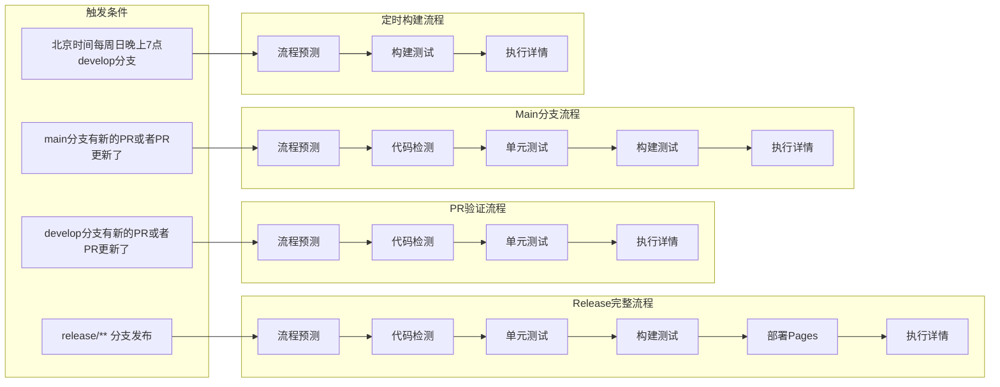

<!--
 * // -----------------------------------------------------------------------------
 * //  Copyright (c) 2025 Vanishing Games. All Rights Reserved.
 * @Author: VanishXiao
 * @Date: 2025-08-16 14:39:46
 * @LastEditTime: 2025-08-16 15:42:01
 * // -----------------------------------------------------------------------------
-->
# Actions

## CI

### 单元测试

运行unity项目中的单元测试

有未通过的测试,则终止流水线

### 构建测试

构建windows 和 macos(arm) 的版本.

构建失败时只警告, 不终止流水线

### 代码风格检测与校准

使用roslynator检查是否有没有正确格式化的代码.

有没有正确格式化的代码,则终止流水线

## CD

### 产物部署到 github pages

将成功构建的产物部署到 github pages 中

产物名称为:
{项目名称}_{构建平台}_v{版本}

这个action要求分支名称是release/{版本}

## 流水线情况

### CICD流程预测

0. 检验设置是否齐全(Secrets之类的)
1. 列出所有全局设置项(从全局配置文件中)
2. 列出所有其他设置(如commit 标记,release版本)
3. 预测将要执行的流程

在PR名称中添加以下关键字来控制CI/CD行为：

| 关键字 | 描述 | 使用场景 |
|--------|------|----------|
| `[SKIP CICD]` | 完全跳过CI/CD流程 | 仅更新文档或配置时 |
| `[SKIP TEST]` | 跳过单元测试步骤(如果有) | 同上 |
| `[SKIP BUILD]` | 跳过构建步骤(如果有) | 在功能分支测试构建时 |

### CICD执行详情

打印出流水线执行详情

# 触发与流水线

# 流水线设置

流水线中的相关变量和设置除了secrets以外全部读取workflows中的全局配置文件