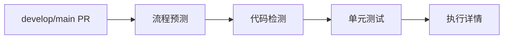

# 🚀 CI/CD 流水线配置文档

这个文件夹包含了统一管理的CI/CD流水线配置，所有的设置都集中在这里，方便维护和理解。

## 📁 配置文件说明

### `pipeline-settings.json`
**主配置文件** - 包含完整的流水线设置和选项说明

这是唯一的配置文件，包含以下所有设置：

#### 🎯 项目信息 (`project`)
- `name`: 项目名称
- `displayName`: 项目显示名称  
- `unityVersion`: Unity版本
- `description`: 项目描述

#### 🔄 触发条件 (`triggers`)
- `branches`: 不同分支的触发规则和构建类型
- `skipKeywords`: PR标题或commit中的跳过关键字

#### 🔧 作业配置 (`jobs`)
每个作业包含：
- `name`: 作业显示名称
- `description`: 作业功能描述  
- `timeout`: 超时时间（分钟）
- `failureAction`: 失败处理方式（`stop_pipeline` 或 `warn_only`）
- `settings`: 具体配置选项

#### 🔑 必需配置 (`requirements`)
- `secrets.required`: 必需的GitHub Secrets
- `secrets.optional`: 可选的GitHub Secrets

#### 📢 通知设置 (`notifications`)
- 流水线执行结果的通知配置

## 🎛️ 作业类型说明

### 1. 单元测试 (`unit_tests`)
- **功能**: 运行Unity EditMode和PlayMode测试
- **失败处理**: 终止流水线 
- **配置项**:
  - `testPaths`: 测试文件路径
  - `generateCoverage`: 是否生成覆盖率报告
  - `quietMode`: 静默模式

### 2. 构建测试 (`build_tests`)  
- **功能**: 构建Windows和macOS版本
- **失败处理**: 仅警告，不终止流水线
- **配置项**:
  - `platforms`: 构建平台列表
  - `retentionDays`: 构建产物保留天数

### 3. 代码风格检测 (`code_style`)
- **功能**: 使用roslynator检查代码格式
- **失败处理**: 终止流水线
- **配置项**:
  - `autoFix`: 是否自动修复格式问题
  - `checkPaths`: 检查的路径
  - `excludePaths`: 排除的路径

### 4. 部署Pages (`deploy_pages`)
- **功能**: 部署构建产物到GitHub Pages  
- **失败处理**: 仅警告
- **配置项**:
  - `artifactNamePattern`: 产物命名模式
  - `branchRequirement`: 分支要求

## 🔀 触发流程

### Release分支流程


### PR验证流程  


### 定时构建流程


## 🛠️ 修改配置

### 添加新的构建平台
在 `jobs.build_tests.settings.platforms` 中添加：
```json
{
  "name": "Linux 64位",
  "buildTarget": "StandaloneLinux64", 
  "os": "ubuntu-latest"
}
```

### 修改超时时间
在对应作业的 `timeout` 字段修改（单位：分钟）

### 添加新的跳过关键字
在 `triggers.skipKeywords.keywords` 中添加：
```json
{
  "keyword": "[SKIP XXX]",
  "action": "skip_xxx",
  "description": "跳过XXX步骤"
}
```

## ⚠️ 注意事项

1. **配置验证**: 修改配置后建议先在测试分支验证
2. **分支规则**: 确保分支名称模式正确匹配
3. **密钥配置**: 在GitHub仓库设置中配置必需的Secrets
4. **格式检查**: 保持JSON格式正确，可使用在线JSON验证工具

## 📚 相关链接

- [GitHub Actions 官方文档](https://docs.github.com/en/actions)
- [Unity GameCI 文档](https://game.ci/)
- [项目CI/CD流程设计](../CICD流程设计.md)
