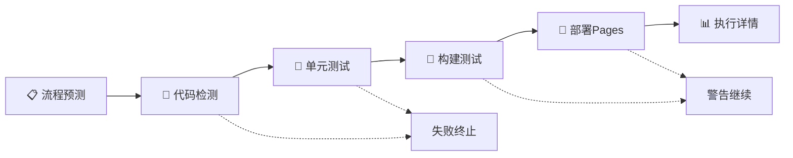

# 🚀 新版CI/CD流水线文档

## 📋 概述

这是全新设计的CI/CD自动化流水线，完全替代了旧版复杂的工作流系统。新版本具有以下特点：

- ✅ **配置集中化** - 所有设置集中在 `Pipeline Config/pipeline-settings.json`
- ✅ **流程清晰化** - 单一主工作流文件，逻辑清晰易懂
- ✅ **命名规范化** - 步骤和作业名称直观明了
- ✅ **文档完善化** - 每个配置项都有详细说明和选项提示

## 🗂️ 文件结构

```
.github/workflows/
├── ci-cd-main.yml              # 🚀 主CI/CD流水线 (唯一的工作流文件)
├── Pipeline Config/            # 📁 配置文件夹
│   ├── pipeline-settings.json  # ⚙️ 主配置文件 (包含所有设置)
│   └── README.md               # 📖 配置文档
└── README.md                   # 📋 本文档
```

## 🔄 流水线流程

### 🎯 触发条件

| 触发方式 | 分支/条件 | 执行流程 |
|----------|-----------|----------|
| **Release发布** | `release/**` 分支推送 | 完整流程：代码检测 → 单元测试 → 构建测试 → 部署Pages |
| **Develop PR** | PR到 `develop` 分支 | 验证流程：代码检测 → 单元测试 |
| **Develop Push** | 直接推送到 `develop` | 验证流程：代码检测 → 单元测试 |
| **Main PR** | PR到 `main` 分支 | CI流程：代码检测 → 单元测试 → 构建测试 |
| **定时构建** | 周日19:00 (北京时间) | 构建流程：构建测试 |
| **手动触发** | 通过界面或CLI | 可选择跳过某些步骤 |

### 📊 执行阶段



#### 阶段说明

1. **📋 流程预测** - 分析触发条件，预测执行步骤
2. **🎨 代码检测** - 使用roslynator检查代码格式 (失败终止流水线)
3. **🧪 单元测试** - 运行Unity EditMode和PlayMode测试 (失败终止流水线)
4. **🔨 构建测试** - 构建Windows和macOS版本 (失败仅警告)
5. **🚀 部署Pages** - 部署到GitHub Pages (失败仅警告)
6. **📊 执行详情** - 汇总所有阶段的执行结果

## 🎛️ 控制关键字

在PR标题或commit消息中使用以下关键字控制流水线行为：

| 关键字 | 作用 | 使用场景 |
|--------|------|----------|
| `[SKIP CICD]` | 完全跳过CI/CD流程 | 仅更新文档或配置时 |
| `[SKIP TEST]` | 跳过单元测试步骤 | 同上 |
| `[SKIP BUILD]` | 跳过构建步骤 | 在功能分支测试时 |

### 使用示例

```bash
git commit -m "docs: 更新README [SKIP CICD]"
git commit -m "feat: 添加新功能 [SKIP BUILD]"
git commit -m "feat: 完整功能实现"  # 正常执行完整流程
```

## ⚙️ 配置管理

### 📍 主配置文件位置

所有配置都在 `Pipeline Config/pipeline-settings.json` 中管理，包含：

- 🎯 **项目信息** - 名称、Unity版本、描述
- 🔄 **触发规则** - 分支模式、定时任务
- 🔧 **作业配置** - 超时时间、失败处理、具体设置
- 🔑 **必需配置** - GitHub Secrets要求
- 📢 **通知设置** - 执行结果通知

### 🔧 修改配置

1. 编辑 `Pipeline Config/pipeline-settings.json`
2. 参考配置文件中的 `description` 字段了解每个选项
3. 提交更改后自动生效

### 常见配置修改

#### 添加新构建平台
```json
{
  "jobs": {
    "build_tests": {
      "settings": {
        "platforms": [
          {
            "name": "Linux 64位",
            "buildTarget": "StandaloneLinux64",
            "os": "ubuntu-latest"
          }
        ]
      }
    }
  }
}
```

#### 修改超时时间
```json
{
  "jobs": {
    "unit_tests": {
      "timeout": 45  // 修改为45分钟
    }
  }
}
```

## 🔑 必需的GitHub Secrets

在仓库设置中配置以下Secrets：

| 名称 | 描述 | 必需性 |
|------|------|--------|
| `UNITY_EMAIL` | Unity账户邮箱 | ✅ 必需 |
| `UNITY_PASSWORD` | Unity账户密码 | ✅ 必需 |
| `UNITY_LICENSE` | Unity许可证内容 | ✅ 必需 |
| `GITHUB_TOKEN` | GitHub Pages部署令牌 | 🔄 自动提供 |

## 📊 产物和报告

### 构建产物

- **命名格式**: `{项目名称}_{构建平台}_v{版本}`
- **保留时间**: 7天 (可在配置中修改)
- **支持平台**: Windows 64位, macOS (ARM)

### GitHub Pages部署

Release分支的构建产物会自动部署到GitHub Pages，包含：

- 📄 构建产物索引页面
- 📦 可下载的构建文件
- 📋 构建信息和版本详情

## ❗ 重要说明

### 🔄 避免重复执行

新的流水线已经解决了PR创建时可能出现的重复执行问题：

- **问题**: 创建PR时，GitHub可能同时触发`pull_request`和`push`事件
- **解决方案**: 
  - 使用`paths-ignore`排除文档和配置文件的更改
  - 精确的触发条件设置，确保每种情况只触发一次
  - PR事件优先于push事件执行

**触发逻辑**:
- 创建develop → main的PR：只触发`pull_request`事件 ✅
- 直接推送到develop：只触发`push`事件 ✅  
- 推送到release分支：只触发`push`事件 ✅

## 🔍 故障排除

### 常见问题

#### 1. Unity许可证错误
```
Error: Could not activate Unity license
```
**解决方案**: 检查并更新 `UNITY_LICENSE` secret

#### 2. 代码格式检查失败
```
Error: Code style check failed
```
**解决方案**: 在本地运行代码格式化工具或在commit中添加 `[SKIP CICD]`

#### 3. 构建超时
```
Error: The job was canceled because it exceeded the maximum execution time
```
**解决方案**: 在配置文件中增加对应作业的 `timeout` 值

### 调试方法

1. 查看 **Actions** 页面的详细日志
2. 检查 **流程预测** 阶段的输出
3. 查看每个阶段的 **执行摘要**
4. 使用手动触发进行测试

## 🆚 与旧版本对比

| 特性 | 旧版本 | 新版本 |
|------|--------|--------|
| **工作流文件数** | 20+ 个复杂文件 | 1 个主文件 |
| **配置文件数** | 8 个分散配置 | 1 个集中配置 |
| **命名规范** | 不明确 | 清晰易懂 |
| **文档完整性** | 部分文档 | 完整文档 |
| **配置说明** | 缺少提示 | 每项都有说明 |
| **流程清晰度** | 复杂难懂 | 直观明了 |

## 🗑️ 旧文件清理

完成新流水线测试后，可以删除以下文件夹：

```bash
# 删除旧的工作流文件
rm -rf .github/workflows-old/

# 删除旧的配置文件  
rm -rf .github/config/
```

## 📚 相关链接

- [GitHub Actions 官方文档](https://docs.github.com/en/actions)
- [Unity Game CI 文档](https://game.ci/)
- [配置文件详细说明](Pipeline Config/README.md)
- [项目CI/CD流程设计](CICD流程设计.md)

---

> **💡 提示**: 新流水线设计注重简洁和可维护性，如有问题请参考配置文件中的详细说明或查看工作流执行日志。
