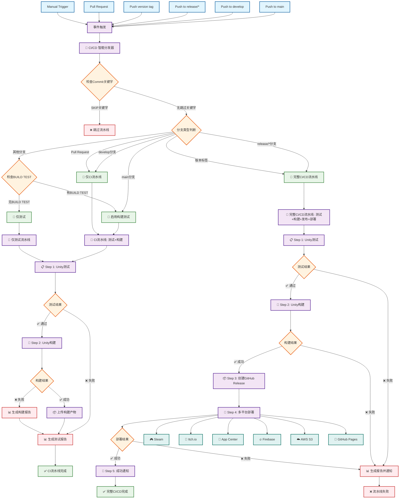
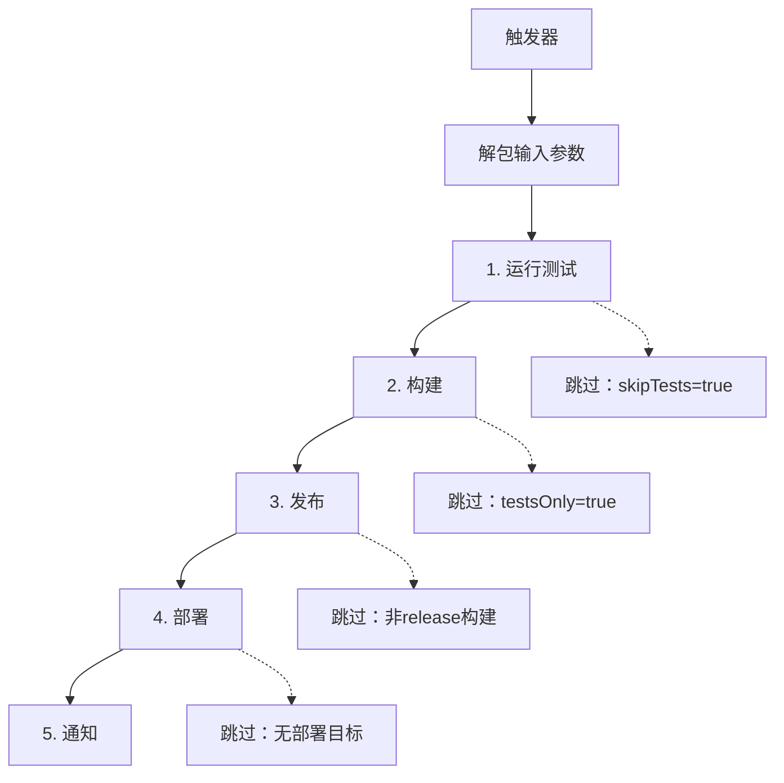

<!--
 * // -----------------------------------------------------------------------------
 * //  Copyright (c) 2025 Vanishing Games. All Rights Reserved.
 * @Author: VanishXiao
 * @Date: 2025-07-07 18:51:09
 * @LastEditTime: 2025-07-08 20:28:58
 * // -----------------------------------------------------------------------------
-->

# 🚀 GitHub Actions 工作流文档

本文档描述了Unity项目的完整CI/CD自动化流水线系统。

## 🎯 整体流程图

以下是完整的CI/CD自动化流水线流程，展示了从代码提交到最终部署的全过程：



### 🔍 流程图说明

#### 📍 触发方式
- **自动触发**: Push代码到特定分支、创建Pull Request、推送版本标签
- **手动触发**: 通过GitHub Actions界面或CLI手动启动

#### 🎛️ 智能路由
- **CI流水线** (测试+构建): 适用于日常开发，快速验证代码质量
- **完整CI/CD流水线** (测试+构建+发布+部署): 适用于正式发布，包含完整发布流程

#### 🔨 构建测试控制
- **main分支**: 自动启用构建测试
- **其他分支**: 默认仅测试，需要 `[BUILD TEST]` 关键字启用构建
- **develop分支**: 始终执行CI流水线（测试+构建）

#### 🚀 部署平台
支持多种部署目标，包括游戏分发平台、云服务和静态托管等：
- **游戏平台**: Steam、Itch.io
- **移动平台**: App Center (iOS/Android)
- **Web平台**: Firebase、GitHub Pages、AWS S3

## 📋 目录

- [整体流程图](#-整体流程图)
- [系统概览](#-系统概览)
- [Commit关键字](#-commit关键字)
- [工作流架构](#-工作流架构)
- [主要工作流](#-主要工作流)
- [辅助工作流](#-辅助工作流)
- [触发条件](#-触发条件)
- [使用示例](#-使用示例)
- [故障排除](#-故障排除)
- [配置说明](#-配置说明)

## 🔍 系统概览

这是一个为Unity项目设计的企业级CI/CD自动化流水线，支持：

- ✅ **自动化测试** - EditMode 和 PlayMode 单元测试
- 🔨 **多平台构建** - 支持Windows、Mac、Linux、iOS、Android等
- 📦 **自动发布** - 创建GitHub Release和标签
- 🚀 **多渠道部署** - Steam、Itch.io、App Store、Google Play等
- 📢 **智能通知** - Slack/Discord集成
- 🎛️ **灵活配置** - 通过JSON配置文件控制行为

## 📋 Commit关键字

在commit消息中使用以下关键字来控制CI/CD行为：

| 关键字 | 描述 | 使用场景 |
|--------|------|----------|
| `[SKIP CICD]` | 完全跳过CI/CD流程 | 仅更新文档或配置时 |
| `[SKIP CI]` | (向后兼容) 跳过CI/CD流程 | 同上 |
| `[BUILD TEST]` | 在非main分支启用构建测试 | 在功能分支测试构建时 |

### 使用示例：
```bash
git commit -m "docs: 更新README [SKIP CICD]"
git commit -m "feat: 添加新功能 [BUILD TEST]"  # 在非main分支启用构建测试
git commit -m "feat: 添加新功能"  # 正常触发完整流程
```

### 构建测试控制规则：
- **main分支**: 默认启用构建测试，无需添加关键字
- **其他分支**: 默认跳过构建测试，需要添加 `[BUILD TEST]` 关键字启用
- **优先级**: commit关键字 > 分支规则

## 🏗️ 工作流架构

### 主流水线 (ci-cd-pipeline.yml)


### 调度器系统
- **ci-cd-dispatcher.yml** - 主调度器，解析配置并启动适当的流水线
- **ci-cd-redeployer.yml** - 重新部署工具，用于已有构建产物的部署

## 🔧 主要工作流

### 1. 🧪 Step 1 - 测试 (step-1-test.yml)
- **功能**: 运行Unity EditMode和PlayMode测试
- **输出**: 测试结果报告和覆盖率数据
- **超时**: 可配置 (默认30分钟)

### 2. 🔨 Step 2 - 构建 (step-2-build.yml) 
- **功能**: 多平台Unity构建
- **支持平台**: Windows, Mac, Linux, iOS, Android, WebGL
- **输出**: 构建产物和版本标签
- **特性**: 并行构建、构建缓存、增量构建

### 3. 📦 Step 3 - 发布 (step-3-release.yml)
- **功能**: 创建GitHub Release
- **触发条件**: release或release_candidate构建类型
- **输出**: Release页面和下载链接

### 4. 🚀 Step 4 - 部署 (step-4-deploy.yml)
- **功能**: 多渠道分发
- **支持平台**: Steam, Itch.io, App Center, Firebase, AWS S3等
- **特性**: 条件部署、回滚支持

### 5. 📢 Step 5 - 通知 (step-5-notify.yml)
- **功能**: 发送构建结果通知
- **渠道**: Slack, Discord
- **内容**: 测试结果、构建状态、部署链接

## 🛠️ 辅助工作流

| 工作流 | 功能描述 |
|--------|----------|
| `prepare-metadata.yml` | 解析项目元数据和构建参数 |
| `unity-tests-runner.yml` | Unity测试执行器 |
| `unity-license-uploader.yml` | Unity许可证管理 |
| `build-version-resolver.yml` | 版本号解析和生成 |
| `build-version-tagger.yml` | Git标签创建 |
| `combine-builds.yml` | 合并多平台构建产物 |
| `resolve-deploy-matrix.yml` | 解析部署目标矩阵 |
| `roslyn-lint.yml` | C#代码质量检查 |
| `summarize-*.yml` | 生成各阶段汇总报告 |

## ⚡ 触发条件

### 自动触发
- **Pull Request** → `develop`, `main` 分支 → 仅CI (测试+构建)
- **Push** → `develop` 分支 → 仅CI
- **Push** → `release/*` 分支 → 完整CICD
- **Push** → 版本标签 (`v1.0.0`, `v1.0.0-rc.1`) → 完整CICD

### 手动触发
```bash
# 通过GitHub CLI触发
gh workflow run ci-cd-dispatcher.yml

# 或通过GitHub网页界面的 Actions → Run workflow
```

## 💡 使用示例

### 开发分支工作流
```bash
# 1. 创建功能分支
git checkout -b feature/new-gameplay

# 2. 开发并提交 (触发PR CI)
git commit -m "feat: 实现新的游戏机制"
git push origin feature/new-gameplay

# 3. 创建PR到develop (触发CI测试)
gh pr create --base develop --title "新游戏机制"
```

### 发布工作流
```bash
# 1. 创建发布分支 (触发完整CICD)
git checkout -b release/v1.2.0
git push origin release/v1.2.0

# 2. 或直接创建版本标签 (触发完整CICD)
git tag v1.2.0
git push origin v1.2.0
```

### 功能分支工作流
```bash
# 功能分支默认只运行测试，需要构建时添加关键字
git commit -m "refactor: 重构玩家控制器"  # 只运行测试
git commit -m "feat: 完成新功能 [BUILD TEST]"  # 运行测试+构建
git push
```

## 🔧 故障排除

### 常见问题

#### 1. Unity许可证失败
```yaml
# 检查secrets配置
UNITY_EMAIL: ✅ 已设置
UNITY_PASSWORD: ✅ 已设置  
UNITY_LICENSE: ❌ 未设置或已过期
```

**解决方案**:
1. 更新Unity许可证secret
2. 运行 `unity-license-uploader.yml` 重新激活

#### 2. 构建失败
```bash
# 检查构建日志中的关键错误
- 编译错误 → 检查代码质量
- 内存不足 → 增加runner规格
- 依赖缺失 → 检查Package Manager配置
```

#### 3. 部署失败
```bash
# 检查部署配置
- Steam: 检查steam用户名/密码/AppID
- Itch.io: 检查Butler API密钥
- 移动平台: 检查签名证书
```

### 调试工具

#### 启用调试模式
在 `pipeline-config.json` 中设置：
```json
{
  "debugging": {
    "enableStepTiming": true,
    "enableEnvironmentDump": true,
    "enableConfigDump": true
  }
}
```

#### 查看详细日志
1. GitHub Actions → 选择失败的工作流
2. 展开失败的步骤
3. 查看"Set up job"和具体步骤的输出

#### 手动重试
```bash
# 重新运行失败的工作流
gh run rerun <run-id> --failed-jobs

# 重新部署已有构建
gh workflow run ci-cd-redeployer.yml
```

## ⚙️ 配置说明

### 必需的Secrets
```yaml
# Unity相关
UNITY_EMAIL: Unity账户邮箱
UNITY_PASSWORD: Unity账户密码
UNITY_LICENSE: Unity Personal/Pro许可证

# GitHub相关  
CICD_PAT: GitHub Personal Access Token (repo权限)
```

### 可选的Secrets (按需配置)
```yaml
# 分发平台
BUTLER_API_KEY: Itch.io API密钥
STEAM_USERNAME: Steam用户名
STEAM_PASSWORD: Steam密码
APPCENTER_OWNER_NAME: App Center所有者

# 通知系统
SLACK_WEBHOOK: Slack Webhook URL
DISCORD_WEBHOOK: Discord Webhook URL
```

### 配置文件优先级
1. `workflow_dispatch` 输入参数 (最高)
2. 分支特定配置
3. `ci-defaults.json` 默认配置 (最低)

---

> **注意**: 请只使用Commit关键字来控制自动化流水线的行为，而不要更改配置文件。

> **TODO(vanish)**: 增加更多commit关键字和构建平台支持