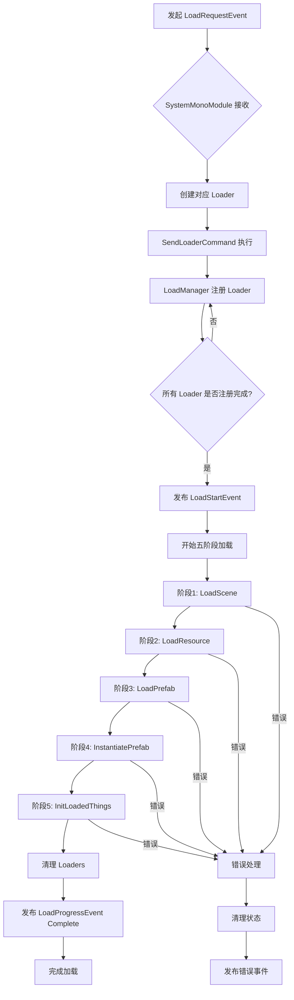

# 本文由 claude-4-sonnet 生成

# Load System Documentation

## 概述
Load System 是一个基于事件驱动的异步加载框架，支持多类型资源的有序加载与管理。系统采用模块化设计，通过统一的接口和事件机制实现解耦的加载流程。

## 核心原理

### 1. 事件驱动机制
- 使用 `MessageBroker` 进行组件间通信
- 通过 `LoadRequestEvent` 触发加载流程
- 支持加载进度、错误处理的事件传播

### 2. 加载器注册机制
- 各 `SystemMonoModule` 监听 `LoadRequestEvent`
- 根据 `LoadInfo` 动态创建对应的 `Loader`
- 通过 `SendLoaderCommand` 将 `Loader` 注册到 `LoadManager`

### 3. 五阶段加载流程
加载器必须按以下顺序执行：
1. **LoadScene**: 场景加载
2. **LoadResource**: 资源加载  
3. **LoadPrefab**: 预制体加载
4. **InstantiatePrefab**: 预制体实例化
5. **InitLoadedThings**: 初始化已加载内容

## 系统架构

```
LoadRequestEvent
       ↓
SystemMonoModule (SceneLoaderManager)
       ↓
LoaderBase (SceneLoader)
       ↓
SendLoaderCommand
       ↓
LoadManager (五阶段执行)
```

## 组件说明

### 核心接口

#### ILoadInfo
```csharp
public interface ILoadInfo
{
    LoaderType GetNeededLoaderType();
}
```
- **职责**: 定义加载信息契约
- **规则**: 必须指明所需的 `LoaderType`

#### ILoader
```csharp
public interface ILoader
{
    LoaderType GetLoaderType();
    void SendLoader();
    UniTask LoadScene();
    UniTask LoadResource(); 
    UniTask LoadPrefab();
    UniTask InstantiatePrefab();
    UniTask InitLoadedThings();
}
```
- **职责**: 定义加载器标准流程
- **规则**: 五个加载阶段必须按顺序实现

### 核心类

#### LoadManager
- **职责**: 中央加载协调器
- **功能**:
  - 注册和管理所有加载器
  - 按五阶段顺序执行加载
  - 处理加载错误和进度报告
- **规则**:
  - 等待所有需要的加载器注册完成后才开始加载
  - 任何阶段出错都会终止整个加载流程

#### SystemMonoModule&lt;T&gt;
- **职责**: 加载器管理器基类
- **功能**:
  - 监听 `LoadRequestEvent`
  - 根据 `LoadInfo` 创建对应加载器
  - 管理事件订阅生命周期
- **规则**:
  - 每个模块只处理特定类型的 `LoadInfo`
  - 加载完成后自动重新注册事件监听

#### LoaderBase&lt;TLoadInfo&gt;
- **职责**: 加载器实现基类
- **功能**:
  - 提供加载器标准实现框架
  - 自动处理加载器注册
- **规则**:
  - 错误直接抛出，由上层处理
  - 泛型约束确保类型安全

## 加载流程图



## 使用规则

### 1. 创建新的加载类型
1. 定义 `LoaderType` 枚举值
2. 实现 `ILoadInfo` 接口
3. 继承 `LoaderBase<TLoadInfo>`
4. 创建对应的 `SystemMonoModule`

### 2. 发起加载请求
```csharp
var loadInfo = new SceneLoadInfo("MenuScene");
var loadEvent = new LoadRequestEvent("SceneLoad");
loadEvent.AddLoadInfo(loadInfo);
MessageBroker.Global.Publish(loadEvent);
```

### 3. 错误处理原则
- 加载器内部错误直接抛出
- `LoadManager` 统一捕获和处理错误
- 错误时自动清理状态和发布错误事件

### 4. 扩展性原则
- 新加载类型通过实现接口扩展
- 保持五阶段加载流程不变
- 使用事件系统保持松耦合

## 事件生命周期

| 事件 | 触发时机 | Complete 条件 | Error 条件 |
|------|----------|---------------|------------|
| LoadRequestEvent | 请求加载时 | 加载完成或失败 | 加载失败时 |
| LoadStartEvent | 开始加载时 | 事件发送后 | 无 |
| LoadProgressEvent | 加载进度更新 | 加载完成或错误 | 加载出错时 |

## 注意事项
- 系统基于 `UniTask` 实现异步操作
- 所有加载器必须在相同的五阶段流程下工作
- 使用 `MonoSingletonLasy` 确保管理器单例
- 错误处理采用抛出异常的方式，避免静默失败
