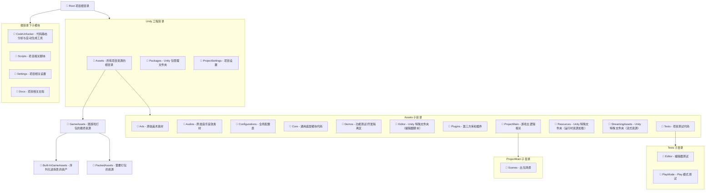

> 《不尬的诗》
> 自信满满写首诗
> 坐到电脑前
> 不出一刻钟
> 写不出来
> 糊弄一下提交上去
> 还挺爽

# 项目构建

> Note: 必须使用国际版的UnityHub

Unity版本: 2022.3.58f1

```
git lfs install 
git clone git@github.com:Vanishing-Games/Unity-Template.git
git submodule update --init --recursive
git lfs checkout
```

> unity国际版
> 
> https://www.logiconsole.com/fuck-unity-cn/
>
> https://github.com/NoUnityCN/NoUnityCN
>
> https://github.com/superwoo/UniHacker
# 目录结构

>💡 GitHub 支持 Mermaid 渲染，确保你直接在 GitHub 上查看以获得图形化展示。
<details> 
<summary>点击展开文件结构图</summary>


</details>

# 代码规范

## 版权声明

```
// -----------------------------------------------------------------------------
//  Copyright (c) 2025 Vanishing Games. All Rights Reserved.
//  Author: YourName
//  Created: 2025-06-30
// -----------------------------------------------------------------------------
```

## 命名规范

### 通用原则

- 尽量使用 **标准美式英语拼写**
- 所有命名都应遵循 `PascalCase` 或 `camelCase`
- 命名应清晰,有描述性,避免缩写和歧义.
- 函数命名为 **动词**

### 命名前缀

| 用途      | 做法                    |
| ------- | ----------------------- |
| 私有成员变量  | 使用 `m_` 或后缀 `_`         |
| 静态变量    | 使用 `s_`                 |
| 布尔变量    | `is` / `has` / `can` 前缀 |
| 全局变量 (慎用)   | `g_`                |
| 常量      | 全大写蛇形 e.g., `MAX_SIZE`  |
| 输入/输出参数 | `in` / `out` 前缀     |

### 注释

- 使用英文作为主要注释语言
- **代码即注释** 禁止毫无意义的注释

    ```c#
    //无用注释
    int count = 0; // 初始化计数器为0
    count++;       // 计数器加1
    ```
- 详细注释应针对函数功能、使用说明、注意事项、TODO、FIXME，或复杂逻辑等
  
    虚幻源码
    ```glsl
    // Fresnel term for iridescent microfacet BRDF model 
    // Simplified version which relies on Schlick's Fresnel and de facto does not take into 
    // account Fresnel phase shift & polarization.
    float3 F_ThinFilm(float NoV, float NoL, float VoH, float3 F0, float3 F90, float     ThinFilmIOR, float ThinFilmTickness)
    ```
- 对于算法,对于每一个步骤写出注释

    Unity 源码
    ``` hlsl
    real3 EvalIridescence(real eta_1, real cosTheta1, real iridescenceThickness, real3 baseLayerFresnel0, real iorOverBaseLayer = 0.0)
    {
        real3 I;

        // iridescenceThickness unit is micrometer for this equation here. Mean 0.5 is  500nm.
        real Dinc = 3.0 * iridescenceThickness;

        // Note: Unlike the code provide with the paper, here we use schlick approximation
        // Schlick is a very poor approximation when dealing with iridescence to the Fresnel
        // term and there is no "neutral" value in this unlike in the original paper.
        // We use Iridescence mask here to allow to have neutral value

        // Hack: In order to use only one parameter (DInc), we deduced the ior of   iridescence from current Dinc iridescenceThickness
        // and we use mask instead to fade out the effect
        real eta_2 = lerp(2.0, 1.0, iridescenceThickness);
        // Following line from original code is not needed for us, it create a discontinuity
        // Force eta_2 -> eta_1 when Dinc -> 0.0
        // real eta_2 = lerp(eta_1, eta_2, smoothstep(0.0, 0.03, Dinc));
        // Evaluate the cosTheta on the base layer (Snell law)
        real sinTheta2Sq = Sq(eta_1 / eta_2) * (1.0 - Sq(cosTheta1));

        // Handle TIR:
        // (Also note that with just testing sinTheta2Sq > 1.0, (1.0 - sinTheta2Sq) can be  negative, as emitted instructions
        // can eg be a mad giving a small negative for (1.0 - sinTheta2Sq), while   sinTheta2Sq still testing equal to 1.0), so we actually
        // test the operand [cosTheta2Sq := (1.0 - sinTheta2Sq)] < 0 directly:)
        real cosTheta2Sq = (1.0 - sinTheta2Sq);
        // Or use this "artistic hack" to get more continuity even though wrong (no TIR,    continue the effect by mirroring it):
        //   if( cosTheta2Sq < 0.0 ) => { sinTheta2Sq = 2 - sinTheta2Sq; => so cosTheta2Sq  = sinTheta2Sq - 1 }
        // ie don't test and simply do
        //   real cosTheta2Sq = abs(1.0 - sinTheta2Sq);
        if (cosTheta2Sq < 0.0)
            I = real3(1.0, 1.0, 1.0);
        else
        {

            real cosTheta2 = sqrt(cosTheta2Sq);

            // First interface
            real R0 = IorToFresnel0(eta_2, eta_1);
            real R12 = F_Schlick(R0, cosTheta1);
            real R21 = R12;
            real T121 = 1.0 - R12;
            real phi12 = 0.0;
            real phi21 = PI - phi12;

            // Second interface
            // The f0 or the base should account for the new computed eta_2 on top.
            // This is optionally done if we are given the needed current ior over the base     layer that is accounted for
            // in the baseLayerFresnel0 parameter:
            if (iorOverBaseLayer > 0.0)
            {
                // Fresnel0ToIor will give us a ratio of baseIor/topIor, hence we *     iorOverBaseLayer to get the baseIor
                real3 baseIor = iorOverBaseLayer * Fresnel0ToIor(baseLayerFresnel0 + 0. 0001); // guard against 1.0
                baseLayerFresnel0 = IorToFresnel0(baseIor, eta_2);
            }

            real3 R23 = F_Schlick(baseLayerFresnel0, cosTheta2);
            real  phi23 = 0.0;

            // Phase shift
            real OPD = Dinc * cosTheta2;
            real phi = phi21 + phi23;

            // Compound terms
            real3 R123 = clamp(R12 * R23, 1e-5, 0.9999);
            real3 r123 = sqrt(R123);
            real3 Rs = Sq(T121) * R23 / (real3(1.0, 1.0, 1.0) - R123);

            // Reflectance term for m = 0 (DC term amplitude)
            real3 C0 = R12 + Rs;
            I = C0;

            // Reflectance term for m > 0 (pairs of diracs)
            real3 Cm = Rs - T121;
            for (int m = 1; m <= 2; ++m)
            {
                Cm *= r123;
                real3 Sm = 2.0 * EvalSensitivity(m * OPD, m * phi);
                //vec3 SmP = 2.0 * evalSensitivity(m*OPD, m*phi2.y);
                I += Cm * Sm;
            }

            // Since out of gamut colors might be produced, negative color values are   clamped to 0.
            I = max(I, float3(0.0, 0.0, 0.0));
        }

        return I;
    }
    ```

### 命名空间

- 不使用过细命名空间

### Formatting

- 使用 [CSharpier](https://csharpier.com) 标准

## 类成员排列顺序规范

为提升代码可读性和维护性，类内部成员建议按照如下顺序排列（以实际示例为准）：

1. 事件（Event）
2. 属性（Property）
3. 公有方法（public）
4. 索引器（Indexer）
5. 运算符重载、显式接口实现
6. 构造函数、析构函数
7. Unity 生命周期函数（如 Awake、OnEnable、Start、Update、OnDisable、OnDestroy 等）
8. 保护方法（protected）
9. 私有方法（private）
10. 嵌套类型（类、结构体、枚举等）
11. 常量、静态只读字段（`const`/`static readonly`）
12. 静态字段、静态属性、静态事件
13. 实例只读字段（`readonly`）
14. 实例字段（含 `[SerializeField]` 字段）

**Unity 生命周期函数补充说明：**
- 所有生命周期函数建议统一放在构造/析构函数之后，保护/私有方法之前。
- 推荐顺序：Awake → OnEnable → Start → Update → FixedUpdate → LateUpdate → OnDisable → OnDestroy → 其他回调（如 OnTriggerEnter、OnCollisionEnter、OnGUI 等）。
- 建议用 `#region Unity Lifecycle` 包裹所有生命周期函数，便于查阅和维护。
- 生命周期函数内部建议只做必要的初始化、状态切换、事件注册/注销等，复杂逻辑应拆分到私有方法中。

**注意：**
- 同一类型成员建议按访问修饰符排序（public > protected > private）。
- Unity 项目中 `[SerializeField]` 字段建议靠前。
- 可使用 `#region` 分组提升可读性。

**示例：**

```csharp
public class Example : MonoBehaviour
{
    // 1. 事件
    public event Action OnChanged;

    // 2. 属性
    public int Count { get; private set; }

    // 3. 公有方法
    public void DoSomething() { ... }

    // 4. 索引器
    public int this[int index] { get { ... } set { ... } }

    // 5. 运算符重载
    public static Example operator +(Example a, Example b) { ... }
    
    // 6. 构造/析构
    public Example(int id) { ... }
    ~Example() { ... }

    // 7. Unity 生命周期函数
    private void OnEnable() { ... }
    private void Update() { ... }
    private void OnDisable() { ... }
   
    // 8. 保护方法
    protected void OnSomething() { ... }

    // 9. 私有方法
    private void Helper() { ... }

    // 10. 嵌套类型
    private class Nested { ... }
    
    // 11. 常量、静态只读字段
    public const int MaxValue = 100;
    private static readonly string Version = "1.0";

    // 12. 静态字段/属性/事件
    private static int s_counter;
    public static int Counter => s_counter;
    public static event Action OnStaticEvent;

    // 13. 实例只读字段
    private readonly int _id;

    // 14. 实例字段
    [SerializeField] private string name;
    private int count;
}
```

# 资产命名规范

## 命名格式: 

**type_category_?subcategory_?action_?subcategory_001**

## 示例

```
ui_button_select
ui_button_shop_select
gp_proj_fire_hit_small_001
gp_proj_fire_hit_small_002
gp_booster_bomb_activate
mus_core_jungle_001
```

## 格式

- 使用snake_case
- 使用关键词大写来突出信息,如: mus_factory_main_STOP
- 使用camelCase来表示一个物体,如: enemy_fireDemon_death

## 要求

- 使用英文
- 简明扼要
- 层层嵌套: 按照从概括到具体的原则逐层嵌套
- 合理排序: 方便按照字母顺序合理且高效地对名称进行排序
- 统一数位: xxx 如 001
- 使用动词形式: bomb_activation vs. bomb_activate
- 使用正常时态: chest_destroyed vs. chest_destroy
- 保持单复数一致
- 使用游戏主题来命名: 不要使用机制来命名

## Tips

- 名称不要过长
- 适当使用描述词如 `loop` 表明音乐为循环
- 缩写必须在表中有
- 同一物体,团队用词要统一

## 缩写表

| 缩写      | 全称                 |
| ------- | ----------------------- |
| gp | gameplay         |
| plr    | player                 |
| char    | character |
| amb    | ambience                |
| mus      | music  |

## 反面例子

```
clip_01 # 没有上下文，不明所以
awesome_sound1 # 数字前没加下划线
boss_enemy_eggman # enemy 比 boss 更宽泛；应改用 enemy_boss_eggman
GreatArt_1 GreatArt_2 GreatArt_10 # 数位不一致
sfx_env_forest_daytime_birds_chirping_loop_ambient_lowIntensity_01.wav # 太长
```

# 版本控制

## 工作流

- Work Flow:  [GitHub Flow](https://www.atlassian.com/git/tutorials/comparing-workflows/gitflow-workflow)
- 信息提交规范: [Conventional Commits](https://www.conventionalcommits.org/en/v1.0.0/)
- 信息提交语言: 中英皆可

中文参考视频: [十分钟学会正确的github工作流，和开源作者们使用同一套流程](https://www.bilibili.com/video/BV19e4y1q7JJ/?share_source=copy_web&vd_source=88fb31e592415ac4c2c88172e6de6e95)

## Issues

### 为什么使用Issue?

- 开发任务的追踪入口，与 PR、Projects 联动
- 提高沟通效率

### 参考资料

[github docs](https://docs.github.com/en/issues/tracking-your-work-with-issues/about-issues)

## Projects

> 实践时建议使用各种成熟的Project模板.

### 为什么使用Projects?

- 无缝衔接 Issue 和 PR
- 支持自动化

### 参考资料

[github docs](https://docs.github.com/zh/issues/planning-and-tracking-with-projects/learning-about-projects)

# 未整理

## 开发规范

TDD(Test-Driven Development)

## 三方库

- ConsolePro
- Odin
- DOTween