# 项目构建

```
git clone git@github.com:Vanishing-Games/Unity-Template.git
git lfs install 
git pull
```

# 目录结构

>💡 GitHub 支持 Mermaid 渲染，确保你直接在 GitHub 上查看以获得图形化展示。

```mermaid
flowchart TD
    %% 根目录
    Root["📁 Root 项目根目录"]
    
    subgraph UnityProject["Unity 工程目录"]
        direction TB
        Assets["📁 Assets - 所有项目资源的根目录"]
        Packages["📁 Packages - Unity 包管理文件夹"]
        ProjectSettings["📁 ProjectSettings - 项目设置"]
    end

    subgraph RootSub["根目录下子模块"]
        CodeUnfucker["📁 CodeUnfucker - 代码静态分析与自动生成工具"]
        Scripts["📁 Scripts - 项目相关脚本"]
        Settings["📁 Settings - 项目相关设置"]
        Docs["📁 Docs - 项目相关文档"]
    end

    Root --> UnityProject
    Root --> RootSub

    subgraph AssetsSub["Assets 子目录"]
        Arts["📁 Arts - 原始美术素材"]
        Audios["📁 Audios - 原始音乐音效素材"]
        Configurations["📁 Configurations - 全局配置表"]
        Core["📁 Core - 通用底层模块代码"]
        Demos["📁 Demos - 功能测试/开发隔离区"]
        Editor["📁 Editor - Unity 特殊文件夹（编辑器脚本）"]
        Plugins["📁 Plugins - 第三方库和插件"]
        ProjectMain["📁 ProjectMain - 游戏主逻辑相关"]
        Resources["📁 Resources - Unity 特殊文件夹（运行时资源加载）"]
        StreamingAssets["📁 StreamingAssets - Unity 特殊文件夹（流式资源）"]
        Tests["📁 Tests - 项目测试代码"]
    end

    Assets --> AssetsSub

    subgraph ProjectMainSub["ProjectMain 子目录"]
        Scenes["📁 Scenes - 出包场景"]
    end
    ProjectMain --> ProjectMainSub

    G["📁 GameAssets - 随游戏打包的最终资源"]
    BuiltInGameAssets["📁 Built-InGameAssets - 序列化进场景的资产"]
    PackedAssets["📁 PackedAssets - 需要打包的资源"]
    Assets --> G
    G --> BuiltInGameAssets
    G --> PackedAssets

    subgraph TestsSub["Tests 子目录"]
        EditorTests["📁 Editor - 编辑器测试"]
        PlayMode["📁 PlayMode - Play 模式测试"]
    end
    Tests --> TestsSub
```

<details> <summary>点击展开文件结构图</summary>

</details>

# 代码规范

## 版权声明

```
// -----------------------------------------------------------------------------
//  Copyright (c) 2025 Vanishing Games. All Rights Reserved.
//  Author: YourName
//  Created: 2025-06-30
// -----------------------------------------------------------------------------
```

## 命名规范

### 通用原则

- 使用 **标准美式英语拼写**
- 所有命名都应遵循 `PascalCase` 或 `camelCase`
- 命名应清晰,有描述性,避免缩写和歧义.
- 函数命名为 **动词**

### 命名前缀

| 用途      | 做法                    |
| ------- | ----------------------- |
| 私有成员变量  | 使用 `m_` 或后缀 `_`         |
| 静态变量    | 使用 `s_`                 |
| 布尔变量    | `is` / `has` / `can` 前缀 |
| 全局变量    | `g_`（慎用）                |
| 常量      | 全大写蛇形 e.g., `MAX_SIZE`  |
| 输入/输出参数 | `in` / `out` 前缀     |

### 注释

- 使用英文作为主要注释语言
- **代码即注释** 禁止毫无意义的注释

    ```c#
    //无用注释
    int count = 0; // 初始化计数器为0
    count++;       // 计数器加1
    ```
- 详细注释应针对函数功能、使用说明、注意事项、TODO、FIXME，或复杂逻辑等
  
    虚幻源码
    ```glsl
    // Fresnel term for iridescent microfacet BRDF model 
    // Simplified version which relies on Schlick's Fresnel and de facto does not take into 
    // account Fresnel phase shift & polarization.
    float3 F_ThinFilm(float NoV, float NoL, float VoH, float3 F0, float3 F90, float     ThinFilmIOR, float ThinFilmTickness)
    ```
- 对于算法,对于每一个步骤写出注释

    Unity 源码
    ``` hlsl
    real3 EvalIridescence(real eta_1, real cosTheta1, real iridescenceThickness, real3 baseLayerFresnel0, real iorOverBaseLayer = 0.0)
    {
        real3 I;

        // iridescenceThickness unit is micrometer for this equation here. Mean 0.5 is  500nm.
        real Dinc = 3.0 * iridescenceThickness;

        // Note: Unlike the code provide with the paper, here we use schlick approximation
        // Schlick is a very poor approximation when dealing with iridescence to the Fresnel
        // term and there is no "neutral" value in this unlike in the original paper.
        // We use Iridescence mask here to allow to have neutral value

        // Hack: In order to use only one parameter (DInc), we deduced the ior of   iridescence from current Dinc iridescenceThickness
        // and we use mask instead to fade out the effect
        real eta_2 = lerp(2.0, 1.0, iridescenceThickness);
        // Following line from original code is not needed for us, it create a discontinuity
        // Force eta_2 -> eta_1 when Dinc -> 0.0
        // real eta_2 = lerp(eta_1, eta_2, smoothstep(0.0, 0.03, Dinc));
        // Evaluate the cosTheta on the base layer (Snell law)
        real sinTheta2Sq = Sq(eta_1 / eta_2) * (1.0 - Sq(cosTheta1));

        // Handle TIR:
        // (Also note that with just testing sinTheta2Sq > 1.0, (1.0 - sinTheta2Sq) can be  negative, as emitted instructions
        // can eg be a mad giving a small negative for (1.0 - sinTheta2Sq), while   sinTheta2Sq still testing equal to 1.0), so we actually
        // test the operand [cosTheta2Sq := (1.0 - sinTheta2Sq)] < 0 directly:)
        real cosTheta2Sq = (1.0 - sinTheta2Sq);
        // Or use this "artistic hack" to get more continuity even though wrong (no TIR,    continue the effect by mirroring it):
        //   if( cosTheta2Sq < 0.0 ) => { sinTheta2Sq = 2 - sinTheta2Sq; => so cosTheta2Sq  = sinTheta2Sq - 1 }
        // ie don't test and simply do
        //   real cosTheta2Sq = abs(1.0 - sinTheta2Sq);
        if (cosTheta2Sq < 0.0)
            I = real3(1.0, 1.0, 1.0);
        else
        {

            real cosTheta2 = sqrt(cosTheta2Sq);

            // First interface
            real R0 = IorToFresnel0(eta_2, eta_1);
            real R12 = F_Schlick(R0, cosTheta1);
            real R21 = R12;
            real T121 = 1.0 - R12;
            real phi12 = 0.0;
            real phi21 = PI - phi12;

            // Second interface
            // The f0 or the base should account for the new computed eta_2 on top.
            // This is optionally done if we are given the needed current ior over the base     layer that is accounted for
            // in the baseLayerFresnel0 parameter:
            if (iorOverBaseLayer > 0.0)
            {
                // Fresnel0ToIor will give us a ratio of baseIor/topIor, hence we *     iorOverBaseLayer to get the baseIor
                real3 baseIor = iorOverBaseLayer * Fresnel0ToIor(baseLayerFresnel0 + 0. 0001); // guard against 1.0
                baseLayerFresnel0 = IorToFresnel0(baseIor, eta_2);
            }

            real3 R23 = F_Schlick(baseLayerFresnel0, cosTheta2);
            real  phi23 = 0.0;

            // Phase shift
            real OPD = Dinc * cosTheta2;
            real phi = phi21 + phi23;

            // Compound terms
            real3 R123 = clamp(R12 * R23, 1e-5, 0.9999);
            real3 r123 = sqrt(R123);
            real3 Rs = Sq(T121) * R23 / (real3(1.0, 1.0, 1.0) - R123);

            // Reflectance term for m = 0 (DC term amplitude)
            real3 C0 = R12 + Rs;
            I = C0;

            // Reflectance term for m > 0 (pairs of diracs)
            real3 Cm = Rs - T121;
            for (int m = 1; m <= 2; ++m)
            {
                Cm *= r123;
                real3 Sm = 2.0 * EvalSensitivity(m * OPD, m * phi);
                //vec3 SmP = 2.0 * evalSensitivity(m*OPD, m*phi2.y);
                I += Cm * Sm;
            }

            // Since out of gamut colors might be produced, negative color values are   clamped to 0.
            I = max(I, float3(0.0, 0.0, 0.0));
        }

        return I;
    }

    void main()
    {
    	float topIor = 1.0; // Default is air
    	float viewAngle = clampedNdotV;

    	if (HasFlag(bsdfData.materialFeatures, MATERIALFEATUREFLAGS_LIT_CLEAR_COAT))
        {
            topIor = lerp(1.0, CLEAR_COAT_IOR, bsdfData.coatMask);
            // HACK: Use the reflected direction to specify the Fresnel coefficient for     pre-convolved envmaps
            if (bsdfData.coatMask != 0.0f) // We must make sure that effect is neutral when     coatMask == 0
                viewAngle = sqrt(1.0 + Sq(1.0 / topIor) * (Sq(dot(bsdfData.normalWS, V)) -  1.0));
        }


    	bsdfData.fresnel0 = lerp(bsdfData.fresnel0, EvalIridescence(topIor, viewAngle,  bsdfData.iridescenceThickness, bsdfData.fresnel0), bsdfData.iridescenceMask);
    	float3 F = F_Schlick(bsdfData.fresnel0, bsdfData.fresnel90, LdotH);
    	float3 specTerm = F * DV;
    }
    ```

### 命名空间

- 不使用过细命名空间

### Formatting

- 使用 [CSharpier](https://csharpier.com) 标准

# 资产命名规范

## 命名格式: 

**type_category_?subcategory_?action_?subcategory_001**

## 示例

```
ui_button_select
ui_button_shop_select
gp_proj_fire_hit_small_001
gp_proj_fire_hit_small_002
gp_booster_bomb_activate
mus_core_jungle_001
```

## 格式

- 使用snake_case
- 使用关键词大写来突出信息,如: mus_factory_main_STOP
- 使用camelCase来表示一个物体,如: enemy_fireDemon_death

## 要求

- 使用英文
- 简明扼要
- 层层嵌套: 按照从概括到具体的原则逐层嵌套
- 合理排序: 方便按照字母顺序合理且高效地对名称进行排序
- 统一数位: xxx 如 001
- 使用动词形式: bomb_activation vs. bomb_activate
- 使用正常时态: chest_destroyed vs. chest_destroy
- 保持单复数一致
- 使用游戏主题来命名: 不要使用机制来命名

## Tips

- 名称不要过长
- 适当使用描述词如 `loop` 表明音乐为循环
- 缩写必须在表中有
- 同一物体,团队用词要统一

## 缩写表

| 缩写      | 全称                 |
| ------- | ----------------------- |
| gp | gameplay         |
| plr    | player                 |
| char    | character |
| amb    | ambience                |
| mus      | music  |

## 反面例子

```
clip_01 # 没有上下文，不明所以
awesome_sound1 # 数字前没加下划线
boss_enemy_eggman # enemy 比 boss 更宽泛；应改用 enemy_boss_eggman
GreatArt_1 GreatArt_2 GreatArt_10 # 数位不一致
sfx_env_forest_daytime_birds_chirping_loop_ambient_lowIntensity_01.wav # 太长
```

# 版本控制

- Work Flow:  [GitHub Flow](https://www.atlassian.com/git/tutorials/comparing-workflows/gitflow-workflow)
- 信息提交规范: [Conventional Commits](https://www.conventionalcommits.org/en/v1.0.0/)
- 信息提交语言: 中英皆可

中文参考视频: [十分钟学会正确的github工作流，和开源作者们使用同一套流程](https://www.bilibili.com/video/BV19e4y1q7JJ/?share_source=copy_web&vd_source=88fb31e592415ac4c2c88172e6de6e95)


# 未整理

## 开发规范

TDD(Test-Driven Development)

## 三方库

- ConsolePro
- Odin
- DOTween